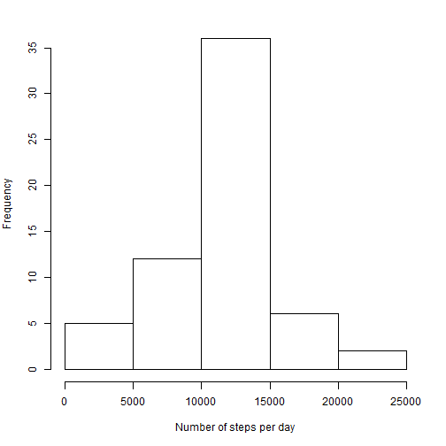

# Reproducible Research: Peer Assessment 1


## Loading and preprocessing the data

```r
#it is assumed that 'activity.zip' file is in working directory
unzip(zipfile="activity.zip")
data <- read.csv("activity.csv", na.strings = "NA", header = TRUE)
#tranform date variable to the date data type
data$date = as.Date(as.character(data$date), "%Y-%m-%d")
```

## What is mean total number of steps taken per day?

```r
#calculate the number of steps taken per day
daysteps<-tapply(data$steps, data$date, sum, na.rm=TRUE)
#create histogram
par(mar=c(5,4,2,2))
hist(daysteps, xlab="No of steps per day", main=NULL)
```

 

```r
mean1<-mean(daysteps)
print(mean1)
```

```
## [1] 9354
```

```r
median1<-median(daysteps)
print(median1)
```

```
## [1] 10395
```

The mean total number of steps taken per day is *9354.2295*, and the median total number of steps taken per day is *10395*.

## What is the average daily activity pattern?

```r
#Make a time series plot (i.e. type = "l") of the 5-minute interval (x-axis) 
#and the average number of steps taken, averaged across all days (y-axis)
data2<-aggregate(steps~interval, data=data, FUN=mean, na.rm=TRUE)
par(mar=c(5,4,2,2))
plot(data2$interval, data2$steps, type='l', ylab= "Average No of Steps", xlab= "Five minute time interval")
```

 

```r
#Which 5-minute interval, on average across all the days in the dataset, 
#contains the maximum number of steps?
maxinterval<-data2[data2$steps==max(data2$steps),'interval']
maxsteps<-data2[data2$steps==max(data2$steps),'steps']
```

The *835*-th five-minute interval contained the maximal *206.1698* number of steps.

## Imputing missing values
There are a number of days/intervals where there are missing values (coded as NA). 
The presence of missing days may introduce bias into some calculations or summaries of the data.


```r
#Calculate and report the total number of missing values in the dataset 
#(i.e. the total number of rows with NAs)
NoMissing<-is.na(data$steps)
sum(NoMissing)
```

```
## [1] 2304
```

The missing values were substitued with the interval mean value.
The new dataset is equal to the original dataset but with the missing data filled in was created.
How to do this in easy way was found [here] (http://stackoverflow.com/questions/20273070/function-to-impute-missing-value).
Then the histogram of the total number of steps taken each day was created and 
the mean and median total number of steps taken per day was calculated.

```r
cleandata<-data
cleandata$steps[is.na(cleandata$steps)] <- ave(cleandata$steps, cleandata$interval, 
                                        FUN = function(x) 
                                        mean(x, na.rm = TRUE))[c(which(is.na(cleandata$steps)))]
a<-tapply(cleandata$steps,cleandata$date,sum)
par(mar=c(5,4,2,2))
hist(a, xlab="No of steps per day", main=NULL)
```

 

```r
mean(a)
```

```
## [1] 10766
```

```r
median(a)
```

```
## [1] 10766
```
We can see that these values differ from the estimates from the first part of the assignment. 
They are both higher now. Moreover, the distrigution of the data is much symmetrical now since the median and mean values are identical.


## Are there differences in activity patterns between weekdays and weekends?

```r
#since I'm using non english system I overwrite local language settings to get the days in english.
Sys.setlocale("LC_TIME", "English")
```

```r
cleandata$weekend<-sapply(cleandata$date,function(x){
                  if (weekdays(x)=="Sunday" | weekdays(x) == "Saturday") {"weekend"}
			else {"weekday"}
			})

data3<-aggregate(steps~interval+weekend, data=cleandata, FUN=mean)
require(lattice)
xyplot(steps~interval | weekend, type='l', data=data3, layout = c(1, 2), ylab= "Average No of Steps", xlab= "Five minute time interval")
```

 
